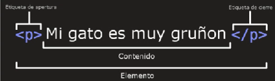
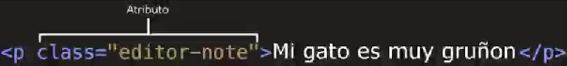
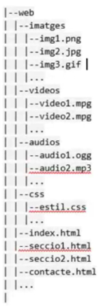

# ASIX1_0373_A00_IntroGithub
## Primer repositorio del curso 2025-2026 de ASIX1
### Es mi primera toma de contacto con github
#### Soy Diego Montero

Etiquetas básicas de Markdown

## Encabezados
**Encabezados** llevan asociados un estilo por defectos cada una y sirven para inicar secciones de documentos

# H1
## H2
### H3
#### H4
##### H5
###### H6

## Estilos de letra

### Negrita
Esto esta en  __negrita__
Esto esta en **negrita** también

### Cursiva
Esto esta en _cursiva_
Esto esta en *cursiva*

### Tachado
~~palabra~~

### Anidar estilos

**palabra1 _palabra2_** las 2 palabras se veran en itálica, pero la segunda además en negrita

ABRIR ETIQUETA 1
    ABRIR ETIQUETA 2
        Contenido
    CERRAR ETIQUETA 2
CERRAR ETIQUETA 1

**_*TEXTO**

## Lista ordenada 

1. Elemento 1
* Elemento desordenado 1.1 
* Elemento desordenado 1.2
2. Elemento 2
* Elemento desordenado 2.1
* Elemento desordenado 2.2
3. Elemento 3

## Lista desordenada

* Elemento desordenado 1
* Elemento desordenado 2
* Elemento desordenado 3

## Texto random

grgrgrgrgryghrgrhgyhrgyrhgyryhghrhygryhghrh
grgrgrggggggggggggggggggggggggggggggggggggggg
grrrrrrrrrrrrrrrrrrrrrrrrrrrrrrrrrrrrrgrrrr

grgrrrrrragaghufyegfyregyergyergyr
rgqrgrghrghryghryghrygruhg
grgrrrrrrrrrrrrrr

## Parrafo
```html
<p>esto es un parrafo</p>
```

## Enlace
[link](https://www.wwe.com/ "Manal oficial de WWE")
a) Primero se incluye el texto del link entre corchetes y posteriormente el link en paréntesis

b) El "titulo opcional del enlace " es el texto alternativo al pasar el ratón por encima

## Foto


## Tabla

La primera línea son los encabezados de las columnas<br>
Los dos puntos (ver en linea 2) se usan para alinear las columnas (izquierda, centrado,derecha)<br>
No es necessario que estén alineadas verticalmente.Solo a nivel visual para claridad del código<br>
Se han de poner al menos tres guiones para separar cada enzabezado
 
| *Jugador* | Equipo | Nombre | 
|---------:|:----------------:|:-----------------|
| 32 | Lakers | Magic Johson |
| 33 | Celtics | Boston Celtics |
| 34 | Warriors | Connor McGregor |


## Notas al pie de página
Texto con enlace a nota de pie de página [^1]
HOLAHOLAHOLAOHLAOHOLAOHLAOLHOALAOLGOALGOALHOLAOFLGOHOLAOHLAOL
[^1] Aqui encuentras el texto de la nota al pie de página

## Listqs de verificación
- [] A
- [x] B
- [] C

(Dejar un espacio en blanco entre los dos corchetes en las que aparezacan vacias )


## ESTO ES HTML

<p><strong>HTML (HyperText Markup Language)</strong> : es el lenguaje de marcado estándar para crear páginas web. Lenguaje mñas importante de Intenet dado que sin HTML no se vería nada en el navegador</p>

<p><strong>HTML</strong> define la estructura y el contenido (es decir, si hay una imagen, una lista de elementos, un enlace, un párrafo, un titular, etc..) de las páginas web mediante etiquetas, es muy adaptable, tiene una estructura lógica y es muy fácil de enteder e interpretar. DESCRIBE EL CONTENIDO</p>

<p>Usamos el <strong>CSS</strong> para modificar el contenido</p>

<p>Los elementos <strong>HTML</strong> son los bloques de construcción de las páginas HTML</p>


<p>Cada elemento <strong>HTML</strong> está delimitado por etiquetas, como <b>(body) , (head) (p) (h1)</b> etc</p>


<p>HTML fue desarrolado en 1991 por <strong>Tim Berners-Lee</strong></p>


### INTRODUCIÓN A HTML
<hr>

Cada etiqueta HMTL, empiezan con (que y menor que)

<p><strong>HyperText:</strong> su significado es hipertexto, que no es más que un texto que enlaza con otros contenidos
</p>

<p><strong>Markup: </strong>significa marca o etiqueta, por qué todas la páginas web están construidas en base a etiquetas</p>

<p><strong>Language:</strong> su significado es lenguaje, por que HTML es un lenguaje, es decir, tiene sus normas, un punto importante, es que html no es un kenguaje de programación, ya que no tiene estructuras de lenguaje de programación, como los bucles, las condiciones etc..</p>

### ELEMENTOS (HTML)
<hr>

<p>es un lenguaje que define la estructura de su contenido </p>

<p>Esto implica que la información a mostrar ha de ir "etiquetados</p>

```html
<p>Me llamo Diego</p>
```

#### Las partes principales del elemento son:
<hr>

<p><strong>La etiqueta de abertura:</strong> consiste en el nombre del elemento (en este caso, p), encerrado por parentesis anguiares (< > ) de apertura y cierre, Establece donde comienza a tener efecto el elemento</p>

<p><strong>La etiqueta de cierre:</strong> practicamente igual a la inicio, solo que lleva una barra de cierre (/) antes del nombre de la etiqueta, Establece donde termina cada elemnto</p>

<p><strong>El contenido:</strong> este es el contenido del elemento, que en este caso es solo texto</p>

<p><strong>El elemento:</strong> La etiqueta de apertura, más la etiqueta de cierre, más el contenido equivale al elemento</p>




### LOS ELEMENTOS PUEDEN TAMBIÉN TENER ATRIBUTOS
<hr>




<p>Los atributos contienen datos addicionales del elemento, en el ejemplo se ve <strong>class</strong> es <strong>el nombre del atributo</strong> y el editor-note el <strong> valor del atributo</strong></p>

<p>Además se pueden colocar elementos dentro de otros elementos, esto se llama <strong>anidamiento</strong></p>

<p>A los elementos que no possen contenido,se les llama <strong>elementos vacios</strong></p>

### ESTRUCTURA BÁSICA DE UN FICHERO HTML
<hr>

<p> Una página<strong> (HTML)</strong> incluye una declaración <strong>(DOCTYPE)</strong> un elemento html, dentro de este, un head y un body </p>

<p>El head contiene metadatos y enlaces a hojas de estilo y scripts, mientras que el body contiene el contenido principal de la página web</p>

<h4>Un ejemplo de estructura</h4>

```html
<!DOCTYPE html>
<html lang="es">
<head>
    <meta charset="UTF-8">
    <meta name="viewport" content="width=device-width, initial-scale=1.0">
    <title>Primera pagina</title>
</head>
</html>
```
<p><strong>(!DOCTYPE html)</strong> Indica el tipo de Documento</p>
<p><strong>(html)</strong> Encierra todo el contenido de la página entera</p>
<p><strong>(head)</strong> aquel contenedor de todo aquello que queremos añadir en la página HTML, no es contenido visible por los visitantes de la páginas</p>

### ELEMENTOS DE BLOQUE Y LÍNEA
<hr>

<p>Dentro del cuerpo del documento (marcado con la etiqueta body) tenemos que poner todo el contenido de la página web, hay diferentes atributos, que nos permitirán conseguir el resultado que queremos</p>

<p>Los elementos descendientes de HTML se pueden clasificar en dos tipos:</p>

<p><strong>Elementos de bloque </strong>(block elements)</p>

<p>Son grandes estructuras que contienen otros elementos de bloque, elementos de linea o texto. Son ejemplos de elementos de bloque los títulos, los párrafos, las listas o las tablas</p>


```html
<h1> - <h6> (encabezado), <p> (párrafo), <br> (salto de línea), <hr> (separador), <blockquote> (cita), <pre> (texto preformateado), <div> (división)
```

<p><strong>Elementos de linea </strong>(inline elements)</p>

<p>Son pequeñas estructuras que represetan o describen pequeños trozos de texto o datos. Son ejemplos de elementos de línea los hipervínculos, las citas o en las imágenes</p>

```html
<em> (énfasis/cursiva), <strong> (fuerte énfasis/negrita), <q> (citas cortas), <span> (rango), <cite>, <abbr>, <code>
```

### RESUMEN DE NORMAS BÁSICAS DE ETIQUETAS HTML
<hr>

<p>Las etiquetas HTML normalmente vienen en pares, con una etiqueta de apertura y una de cierre, por ejemplo</p>

```html
<p> y </p>
```
<p>Algunas etiquetas, conocidas como etiquetas vacías, no tienen una etiqueta de cierre, como</p>

```html
, <br> y <input>
```
<p>Las etiquetas HTML deben anidarse correctamente. Si abrimos una etiqueta de </p>

```html
<p><strong> strong se abre dentro de p y se cierra dentro de p <strong></p> 
```
<p>Los atributos de las etiquetas se especofican en la etiqueta de abertura y suelen tener el formato nombre="valor". Por ejemplo, en </p>

```html
 aquel atributo que especifica la ruta de la imagen
```
<p><strong>Como recomendación</strong> es que todo se escriba en minúsculas</p>


### LEGIBILIDAD Y ORGANIZACIÓN DEL CÓDIGO

<hr>
<p><strong>Es importante que el código fuente HTML que generemos sea legible, para que fácil de entender</strong></p>

<p>Para estructurar el código fuente de la aplicación web, debemos clasificarlo de la siguiente manera</p>

<p>Para el código sea legible y esté bien organizado</p>

* los comentarios
* la indentación del código
* la organización de los archivos

### COMENTARIOS

<p>En un documento HTML, podemos escribir texto, que no puede verse en el navegador, pero que sirven bastante para el desarrollador web</p>

<p>Para hacer un comentario en HTML, se hace de la siguiente manera</p>

```html
<!--Diego-->
```
<p>Si es el texto, es largo es recomendable usar comentarios</p>

```html
<!DOCTYPE html>
<html lang="es">
<head>
    <meta charset="UTF-8">
    <meta name="viewport" content="width=device-width, initial-scale=1.0">
    <title>Primera pagina</title>
</head>
<body>
    <!--Diego-->
    <!--Montero-->
    </body>
</html>
```
### ORGANIZACIÓN DE LOS ARCHIVOS

<hr>

<p>Como una aplicación web tiene bastantes archivos con extesión.html, hojas de estilo css, imágenes, videos, lo ideal seria ordenarlo</p>

<p>Es recomendable crear un directorio personal, donde dejaremos todos nuestros archivos (web), en este directorio podemos poner todos los archivos.html y crear los directorios que necesitemos para poner los archivos multimedia (imágenes, audios y videos) y los estilos de la aplicación</p>

<p><strong>También es recomendable que el archivo de incio de las aplicaciones tenga el nombre index.html</strong></p>

```html
 aquel atributo que especifica la ruta de la imagen
```

### ETIQUETAS BÁSICAS DE HTML

<hr>

<p><strong>Encabezados (h1... h6)</strong>: Permiten especificar que ciertas partes del contenido son encabezados o subencabezados del contenido.</p>

```html
<h1>Hola mundo</h1>
<h2>Mi primera pagina web</h2>
<h3>Subtitulo</h3>
<h4>Subsubtitulo</h4>
<h5>Subsubsubtitulo</h5>
<h6>Subsubsubsubtitulo</h6>
```
<p><strong>Párrafos (p) </strong>: Se utilizan para encerrar párrafos de texto, entendiendo como párrafo un conjunto de frases relacionadas entre si</p>

```html
<!-- Etiquetas de parrafo -->
    <p>ipsum dolorsit, amet consectetur adipisicing elit. Facere accusamus tempora neque voluptas, alias, eius molestias magni, amet accusantium impedit nesciunt labore quia cupiditate temporibus illum ab blanditiis optio nam.</p>
```
<p><strong>Salto de linea (br) </strong>: Permite agregar un salto de línea (o "intro") entre párrafos</p>

```html
     <!-- Etiquetas de salto de línea -->
    <br>
```
<p><strong>Separador de linea (hr) </strong>: Permite agregar una linea horizontal divisoria. Útil para separar visualmente párrafos por ejemplo</p>

```html
     <!-- Etiquetas de separador de línea -->
    <hr>
```

<p><strong>Emfasis (em, strong) </strong>: Cuando queremos dar énfasis a una parte del texto para destacar su importancia, tenemos a nuestra disposición dos etiquetas.La etiqueta (em) se utiliza para dar énfasis y la etiqueta (strong) para dar mucho énfasis.</p>

```html
     <!-- Etiqueta de destacar y parrafo -->
    <p><em>ipsum dolor</em> sit, amet consectetur adipisicing elit. Facere accusamus tempora neque voluptas, alias, eius molestias magni, amet accusantium impedit nesciunt labore quia cupiditate temporibus illum ab blanditiis optio nam.</p>    
    <p><b>ipsum dolor</b> sit, amet consectetur adipisicing elit. Facere accusamus tempora neque voluptas, alias, eius molestias magni, amet accusantium impedit nesciunt labore quia cupiditate temporibus illum ab blanditiis optio nam.</p>
    <p><strong>ipsum dolor</strong> sit, amet consectetur adipisicing elit. Facere accusamus tempora neque voluptas, alias, eius molestias magni, amet accusantium impedit nesciunt labore quia cupiditate temporibus illum ab blanditiis optio nam.</p>
```

<p><strong>(span)</strong>: en HTML es un <strong>contenedor de línea </strong> que se usa para agrupar una pequeña parte de texto o contenido dentro de un línea, sin romper el flujo del texto. A diferencia de (div), que es un bloque, (span) no crea una nueva línea</p>

```html
  <p><span>ipsum dolor</span> sit, amet consectetur adipisicing elit. Facere accusamus tempora neque voluptas, alias, eius molestias magni, amet accusantium impedit nesciunt labore quia cupiditate temporibus illum ab blanditiis optio nam.</p>
```

### CONTINUACIÓN DE ETIQUETAS BÁSICAS DE HTML

<p><strong>Listas</strong></p>

<p>Las listas <strong>desordenadas</strong> son aquellas en las que el orden de los items no es relevante, como una lista de compras.Estas son encerradas en un elemento <strong>(ul)</strong></p>

<p>Cada <strong>Cada elemento de la lista</strong> se coloca dentro de <strong>(li)</strong></p>

```html
<ul><!-- Etiqueta para definir una lista desordenada -->
        <li>Primer elemento de la lista</li> <!-- Esto es un elemento, se define con "li" -->
        <li>Segundo elemento de la lista</li><!-- Esto es un elemento, se define con "li" -->
        <li>Tercer elemento de la lista</li><!-- Esto es un elemento, se define con "li" -->
    </ul>
```
<p>Las listas <strong>ordenadas</strong> son aquellas en las que el orden  es relevante, como una receta.Estas son encerradas en un elemento <strong>(ol)</strong></p>

<p>Cada <strong>Cada elemento de la lista</strong> se coloca dentro de <strong>(li)</strong></p>

```html
    <ul><!-- Etiqueta para definir una lista desordenada -->
        <li>Primer elemento de la lista</li> <!-- Esto es un elemento, se define con "li" -->
        <li>Segundo elemento de la lista</li><!-- Esto es un elemento, se define con "li" -->
        <li>Tercer elemento de la lista</li><!-- Esto es un elemento, se define con "li" -->
    </ul>
```

### CONTINUACIÓN 1 DE ETIQUETAS BÁSICAS DE HTML
<p>En HTML, cuando necesitamos enlazar a otros archivos, ya sean documentos HTML, hojas de estilo CSS, o imágenes, podemos usar rutas para especificar la ubicación de estos archivos. Existen rutas absolutas y relativas</p>

<p><strong>Ruta absoluta:</strong> especifica la ubicación completa del archivo en la web, comenzando desde el dominio. Es útil cuando el archivo se encuentra en un servidor diferente o en una ubicación específica de la web</p>

<!-- Etiqueta para insertar imagenes -->
```html
    
````

<p><strong>Ruta Relativa:</strong> especifica la ubicación completa del archivo en relación con al ubicación del documento actual, Es útil para mantener una estrucutura de enlaces clara dentro de un mismo sitio web. Las rutas relativas pueden ser simples y facilitar el mantenimiento del sitio</p>

<!-- Etiqueta para insertar imagenes -->
```html
    
```

### Etiquetas de Tablas (1/3)

<p><strong>table:</strong> Define el inicio de una tabla en HTML</p>

<p><strong>Atributos comunes</strong></p>

<p><strong>border:</strong> Define el grosor del borde de la tabla</p>
<p><strong>width:</strong> Especifica el ancho de la tabla</p>


<p><strong>thead:</strong>Agrupa el encabezado de la tabla, normalmente contiene etiquetas (th)</p>

<p><strong>Atributos comunes</strong></p>

<p>No tiene atributos especifícos</p>

<p><strong>tbody:</strong>Agrupa el cuerpo de la tabla.Útil para separar el contenido del encabezado y pie</p>

<p><strong>Atributos comunes</strong></p>

<p>No tiene atributos especifícos</p>

<p><strong>tfoot:</strong>Agrupa el pie de la tabla, generalmente utilizado para resumen o información final</p>

<p>No tiene atributos especifícos</p>

### Etiquetas de Tablas (3/3)

<p><strong>caption:</strong>Proporciona un título o descripción para la tabla.Normalmente se coloca justo después de la etiqueta (table)</p>

<p><strong>Atributos comunes</strong></p>

<p><strong>align:</strong>Alinea el titulo respecto al tabla <strong>top,bottom,left,right</strong></p>


```html


<!--Hacer una tabla-->
    <table border="1"><!--Define una tabla-->
        <thead><!--Encabezado-->
            <tr><!--Define una fila-->
                <th>POSICION</th><!--Define columnas-->
                <th>ATLETA</th><!--Define columnas-->
                <th>TIME</th><!--Define columnas-->
            </tr>
        </thead>
        <tbody><!--Datos-->
               <tr><!--Define una fila-->
                <td>1</td><!--Define columnas-->
                <td>Michel Eaton</td><!--Define columnas-->
                <td>2:23:00</td><!--Define columnas-->
            </tr>
               <tr><!--Define una fila-->
                <td rowspan="2">2</td><!--Define columnas-->
                <td colspan="2">Andrea Boccceli</td><!--Define columnas-->
            </tr>
               <tr><!--Define una fila-->
                <td>Steve carmaikel</td><!--Define columnas-->
                <td>2:50:00</td><!--Define columnas-->
            </tr>

        </tbody>
        <tfoot><!--Pie-->
               <tr><!--Define una fila-->
                <td>POSICION</td><!--Define columnas-->
                <td>ATLETA</td><!--Define columnas-->
                <td>TIME</td><!--Define columnas-->
            </tr>
        </tfoot>
    </table>
```
### Etiquetas de formularios (form)

<p><strong>form:</strong> Se utiliza para crear formularios que permiten al usuario enviar datos a un servidor o realizar alguna acción en una página web</p>

<p><strong>Atributos comunes</strong></p>

<p><strong>Action:</strong> Define la URL donde se enviarán los datos del formulario para su processamiento.Es el destino al que apunta el formulario</p>

<p><strong>Method:</strong>Especifica el método de envió de datos</p>

<p><strong>Enctype:</strong> Define cómo se codifican los datos antes de ser enviados al servidor. Se utiliza principalmente cuando se suben archivos</p>

<p><strong>target:</strong> Indica dónde se debe mostrar la respuesta al enviar el formulario:</p>

<p><strong>_self</strong>(por defecto). La respuesta se carga en la misma ventana</p>

<p><strong>_blank</strong> Abre la respuesta en una nueva pestaña o ventana</p>

### Etiquetas de formularios (input)

<p><strong>input:</strong> Se utiliza para crear diversos tipos de campos interactivos en un formulario</p>

<p><strong>Atributos comunes</strong></p>

<p><strong>type:</strong> Define el tipo de entrada que se debe mostrar valores comunes</p>

<p><strong>id:</strong> Identificador único para el campo, que se puede usar para associar el (label) con el campo de entrada</p>

<p><strong>name:</strong> Nombre del campo de entrada, que se utiliza al enviar al formulario para identificar el dato</p>

<p><strong>value:</strong> Valor predeterminado del campo de entrada o el valor enviado al servidor si el campo no es interactivo</p>

<p><strong>placeholder:</strong> Texto que aparece en el campo cuando está vacío, ofreciendo una pista sobre qué tipo de dato se debe ingresar</p>

<p><strong>required:</strong> Indica el campo debe completarse antes de enviar el formulario</p>

<p><strong>disabled:</strong> Desactiva el campo, evitando que el usuario interactúe con él</p>


<p><strong>readonly:</strong> Hace que el campo sea solo de lectura.evitando que el usuario modifique su contenido</p>

### Etiquetas de formularios (select/option)

<hr>
<p><strong>select o option </strong> Se utiliza para crear menús desplegables en los formularios</p>

<p>Permite al usuario seleccionar <strong>una opción</strong> de una lista de opciones predefinidas</p>

<p><strong>Atributos comunes</strong></p>

<p><strong>name:</strong> Especifica el nombre del control que se usará al enviar el formulario.Este nombre se usará al enviar el formulario.Este nombre se usará como cuando se envíen los datos del formulario al servidor</p>

<p><strong>id:</strong> Identificador único del elemento, que puede usarse para asociar una etiqueta (label) con el menú desplegable</p>

<p><strong>size:</strong> Define el número de opciones visibles en la lista desplegable sin necesidad de desplazar.Si se omite, se mostrará una lista desplegable simple</p>

<p><strong>value:</strong> Indica el valor de la opción</p>


<h3>Etiquetas de formularios (button)</h3>

<p><strong>button</strong> Se utiliza para crear varios tipos de botones interactivos en un formulario o en una página web</p>

<p><strong>Atributos comunes</strong></p>

<p><strong>type:</strong> Define el tipo de botón.</p>

<p><strong>submit:</strong> Envía el formulario cuando se hace clic en el botón</p>

<p><strong>reset:</strong> Restablece los campos del formulario a sus valores iniciales button</p>

<p><strong>name:</strong> Define el nombre del bóton que será enviado con los datos del formulario si el atributo type="submit"</p>

<p><strong>value:</strong> Especifica el valor que se envía al servidor si el bóton es de tipo submit</p>

<p><strong>disabled:</strong> Desactiva el botón, impidiendo que se haga clic en él o que se envíe el formulario si es un botón de envío</p>


```html
<!--Formulario-->
        <form action="URLdeDestino.html" method="GET">
            <label for="username">Username:</label>
            <input type="text" name="username" id="username required">
            <br>
            <label for="realname">Nombre real:</label>
            <input type="text" name="realname" id="realname">
            <br>
            <fieldset>
                <legend>Carnet de conducir</legend>
                <label for="carnetsi">SI:</label>
                <input type="radio" name="carnet" value="carnetsi" id="carnetsi">
                <label for="carnetno">NO:</label>
                <input type="radio" name="carnet" value="carnetno" id="carnetno">
            </fieldset>
            <br>
            <fieldset>
                <legend>Gustos musicales</legend>
                <label for="pop">Pop</label>
                <input type="checkbox" name="musica" value="heavy" id="pop" >
                <label for="pachanga">Heavy:</label>
                <input type="checkbox" name="musica" value="heavy" id="heavy">
                <label for="pachanga">Pachanga</label>
                <input type="checkbox" name="musica" value="heavy" id="Pachanga">
            </fieldset>
            <br>
             <label for="nacionalidad">Nacionalidad:</label>
            <select id="nacionalidad" name="nacionalidad">
                <option value="españa">España</option>
                <option value="usa">USA</option>
                <option value="brasil">Brasil</option>
                
            </select>
            <br>
                  <label for="observaciones">Observaciones</label><br>
            <textarea name="Observaciones" id="observaciones" cols="30" rows="30" placeholder="Introduce aqui cualquier observación que tengas"></textarea>
            <br>
            <button type="submit" name="enviar" value="enviar">Enviar datos</button>
        </form>
    ````


